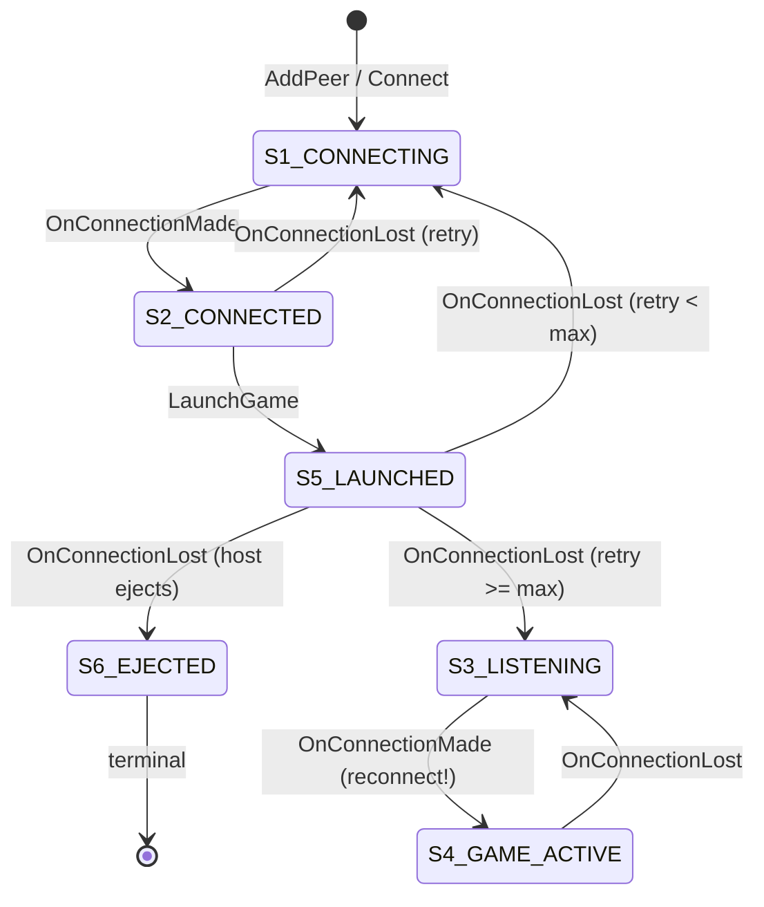

# MohoEngine.dll – Reverse-Engineered Internals

> [!IMPORTANT]
> **DLLs Are Inlined In Production**
> The production game (`ForgedAlliance.exe`) does **not** load `MohoEngine.dll` dynamically. All of these DLLs (except crash handlers like BugSplat) were statically linked or **inlined directly into the executable**.
> 
> **Why this matters for patchers:**
> 1. The addresses listed in this document are **strictly for reference** when analyzing the isolated `MohoEngine.dll` file in Ghidra.
> 2. You **cannot** `VirtualProtect` or hook the DLL addresses here at runtime, because the game isn't running from them.
> 3. To patch these functions in the live game, you must find their inlined equivalents within `ForgedAlliance.exe` by matching the assembly signatures or string references found here.

> **Binary**: `MohoEngine.dll` (loaded by ForgedAlliance.exe v3599)
> All addresses are DLL base-relative. Verified via Ghidra decompilation.
> Supplements `Info.txt`, `moho.h`, and `global.h` – only new findings.

---

## 1. Session Lifecycle (WLD_*)

The complete game session lifecycle is exposed as DLL exports with full C++ mangled names.

| Export | Address | Signature |
|--------|---------|-----------|
| `WLD_SetupSessionInfo` | `0x104500D0` | `void (SWldSessionInfo&)` |
| `WLD_CreateSession` | `0x10459920` | `void ()` |
| `WLD_BeginSession` | `0x10450560` | `void (auto_ptr<SWldSessionInfo>)` |
| `WLD_GetSession` | `0x104599F0` | `CWldSession* ()` |
| `WLD_GetDriver` | `0x10450760` | `ISTIDriver* ()` |
| `WLD_GetSessionLoader` | `0x10448D00` | |
| `WLD_IsSessionActive` | `0x1044F710` | `bool ()` |
| `WLD_Frame` | `0x1044FFE0` | `bool (float deltaTime)` |
| `WLD_SetGameSpeed` | `0x10450720` | |
| `WLD_GetSimRate` | `0x104505B0` | |
| `WLD_IncreaseSimRate` | `0x10450670` | |
| `WLD_DecreaseSimRate` | `0x104506E0` | |
| `WLD_ResetSimRate` | `0x104506B0` | |
| `WLD_RequestEndSession` | `0x1044F720` | |
| `WLD_RequestRestartSession` | `0x1044F740` | |
| `WLD_DestroySession` | `0x104599A0` | |
| `WLD_Teardown` | `0x1044FD80` | |
| `WLD_LoadScenarioInfo` | `0x1044F5D0` | |
| `WLD_LoadMapPreview` | `0x104547D0` | |
| `WLD_CreateProps` | `0x10455280` | |
| `WLD_SetUIProvider` | `0x1044F5A0` | |

### WLD_Frame – 9-State Session Loop (Decompiled)

`WLD_Frame` is the **main game loop**. It dispatches based on `g_SessionState`:

```c
bool WLD_Frame(float deltaTime) {
    (*sessionVtable[0x14])();       // Pre-frame update
    do {
        bool loop = false;
        switch (g_SessionState) {   // DLL 0x109ba854
            case 0: Idle();                     return true;
            case 1: DoLoading();                return true;
            case 2: DoStarted(&loop);           break;
            case 3: DoSimInit(&loop);           break;
            case 4: DoSimStarted();             break;
            case 5: DoGameRunning(&loop);       break;
            case 6: DoGameFrame(deltaTime);     return true;
            case 7: DoRestartRequested();       return true;
            case 8: WLD_Teardown();
                    UI_StartFrontEnd();         return true;
        }
    } while (loop);
    return true;
}
```

### WLD_BeginSession (Decompiled)

```c
void WLD_BeginSession(auto_ptr<SWldSessionInfo> info) {
    if (g_SessionInfoPtr != NULL && g_SessionInfoPtr != info)
        DestroySessionInfo(g_SessionInfoPtr);
    g_SessionInfoPtr = info;
    g_SessionState = 1;  // → Loading
}
```

---

## 2. Sim Singleton API

`Sim::Get()` is a **static singleton accessor**. All exports from MohoEngine.dll:

```cpp
static Sim*           Sim::Get();                        // 0x101334B0
LuaState*             Sim::GetLuaState();                // 0x10133590
uint                  Sim::GetCurrentTick();             // 0x101335B0
uint                  Sim::GetArmyCount();               // 0x101335E0
SimArmy*              Sim::GetArmy(uint index);           // 0x10133600
STIMap*               Sim::GetMap();                     // 0x10133550
ISimResources*        Sim::GetResources();               // 0x10133570
CRandomStream*        Sim::GetRandom();                  // 0x101335C0
COGrid*               Sim::GetOGrid();                   // 0x101335D0
RRuleGameRules*       Sim::GetGameRules();               // 0x10133540
IEffectManager*       Sim::GetEffectManager();           // 0x10133520
ISoundManager*        Sim::GetSound();                   // 0x10133530
MD5Context&           Sim::GetChecksumContext();         // 0x101334E0
const MD5Context&     Sim::GetChecksumContext() const;   // 0x101334F0
MD5Digest             Sim::GetChecksumDigest() const;    // 0x10133500
void                  Sim::UpdateChecksum(void*, uint);  // 0x101334D0
bool                  Sim::IsLoggingActive() const;      // 0x101334C0
bool                  Sim::CheatsEnabledNoRecord() const;// 0x101335A0
```

### SIM_CreateDriver

```cpp
// 0x1030F7C0, allocates 0x230 bytes for ISTIDriver
ISTIDriver* SIM_CreateDriver(
    auto_ptr<IClientManager>    clientMgr,
    auto_ptr<Stream>            replayStream,
    shared_ptr<LaunchInfoBase>  launchInfo,
    unsigned int                flags
);
```

### CLIENT_CreateClientManager

```cpp
// 0x1012CD70, allocates 0x184D0 bytes
IClientManager* CLIENT_CreateClientManager(
    uint           clientCount,
    INetConnector* connector,   // NULL for replay/singleplayer
    int            speedFlags,  // 0=normal, 1=adjustable, 4=fast
    bool           isHost
);
```

---

## 3. Sim::AdvanceBeat – Full Tick Pipeline (Decompiled, 0x10318F50)

This is the **core simulation tick function** (299 lines decompiled).

```
Pipeline Order:
  1. Log "beat %d"                          (+0x908 = beatBase)
  2. Resume Lua coroutine                   (+0x8D8, +0x8E8)
  3. Optional: set Lua debug hook           (g_LuaDebugEnabled = 0x109ba78c)
  4. Check skipTick (+0x8ED) and pauseTarget (+0x8F0)
  5. INCREMENT tickNumber                   (+0x910)
  6. Log "tick number %d"
  7. UNIT TICK: CUnitIterAllArmies → clear reclaim values, TickUnit()
  8. COMMAND SOURCE TICK: iterate +0x920 → vtable[0x3C]
  9. AI BRAIN TICK: round-robin FullTick/QuickTick per army
 10. EFFECT TICK: effectManager→vtable[0x34]  (+0x8D0)
 11. PROP TICK: propManager→vtable[0x10]      (+0x990)
 12. CLEANUP: Unit::KillCleanup for dead units
 13. ENTITY ADVANCE: Entity::AdvanceCoords    (+0xA6C list)
 14. EXTRA UNIT DATA: collect to +0xA38 vector
 15. SHARED PTR SWAP: +0x97C/0x980 → +0x984/0x988
 16. Set beatProcessed=true (+0x8F5), beatFlag=false (+0x8F4)
 17. DEFERRED COMMANDS: ring buffer at +0xA5C-0xA68
 18. CHECKSUM: UpdateChecksum() if beatBase % interval == 0
 19. OBSERVERS: notify list at +0x9B0
 20. Set beatProcessedFlag=true (+0x90C)
```

### Sim Object Layout (0xAF8 bytes total)

| Offset | Field | Type | Verified |
|--------|-------|------|----------|
| `+0x0B0` | checksumHashes | `MD5Digest[128]` (ring buffer) | ✅ |
| `+0x8C0` | effectManagerRef | `IEffectManager*` | ✅ |
| `+0x8D0` | effectManager | `IEffectManager*` (tick target) | ✅ |
| `+0x8D8` | luaThread | `void*` (vtable) | ✅ |
| `+0x8E6` | cheatsEnabled | `bool` | ✅ |
| `+0x8E8` | luaCoroutine | `LuaState*` | ✅ |
| `+0x8ED` | skipTick | `bool` | ✅ |
| `+0x8F0` | pauseTarget | `int` (-1 = none) | ✅ |
| `+0x8F4` | beatFlag | `bool` | ✅ |
| `+0x8F5` | beatProcessed | `bool` | ✅ |
| `+0x8F8` | beatCounter | `int32` | ✅ |
| `+0x8FC` | beatProcessedOld | `bool` | ✅ |
| `+0x900` | tickNumberOld | `int32` | ✅ |
| `+0x908` | beatBase | `int32` (checksum window base) | ✅ |
| `+0x90C` | beatProcessedFlag | `bool` (final done flag) | ✅ |
| `+0x910` | tickNumber | `int32` (incrementing) | ✅ |
| `+0x920` | commandSources | `vector<void*>` | ✅ |
| `+0x92C` | commandSource | `int` (0xFF = spectator) | ✅ |
| `+0x990` | propManager | `void*` | ✅ |
| `+0x9AC` | unk_9AC | `void*` | ✅ |
| `+0x9B0` | observerListHead | `linked_list<Observer>` | ✅ |
| `+0x9BC` | checksumSlots | `void**` (per-beat) | ✅ |
| `+0xA38` | extraUnitData | `vector<SExtraUnitData>` | ✅ |
| `+0xA5C` | deferredCmdRing | `void**` | ✅ |
| `+0xA60` | ringSize | `uint` | ✅ |
| `+0xA64` | ringHead | `uint` | ✅ |
| `+0xA68` | ringCount | `int` | ✅ |
| `+0xA6C` | entityAdvanceListHead | `linked_list` | ✅ |
| `+0xAB8` | unitDataQueue | `void*` | ✅ |

---

## 4. Checksum & Desync Detection

### GetBeatChecksum (0x103176D0)

```cpp
bool Sim::GetBeatChecksum(CSeqNo beat, MD5Digest& outHash) {
    if (beat - beatBase >= -128 && beat - beatBase < 0) {
        int idx = ((beat & 0x7F) + 12) * 16;
        memcpy(&outHash, (char*)this + idx, 16);
        return true;
    }
    return false;  // beat outside 128-beat window
}
```

### SDesyncInfo Constructor (0x10133390)

```cpp
SDesyncInfo(CSeqNo beat, int sourceId, const MD5Digest& localHash, const MD5Digest& remoteHash);
// sizeof(SDesyncInfo) = 0x28
```

### Checksum Exports

| Export | Address |
|--------|---------|
| `Sim::GetBeatChecksum` | `0x103176D0` |
| `Sim::UpdateChecksum` | `0x101334D0` |
| `CMarshaller::VerifyChecksum` | `0x102C1170` |
| `Sim::VerifyChecksum` | `0x103178A0` |
| `DecodeVerifyChecksum` | `0x102BF940` |

---

## 5. CWldSession::DoBeat – SSyncData Processing (Decompiled, 0x10456D40)

692 lines decompiled. This is the **per-beat UI update** – the bridge between Sim and User threads.

### SSyncData Structure (int* offsets, reconstructed)

| Offset | Field | Size per Item |
|--------|-------|---------------|
| `[0]` | beatNumber | — |
| `[1]` | focusArmyIndex | — |
| `[2-3]` | gameSpeed + flag | — |
| `[0x43-44]` | newArmies | 0x88 |
| `[0x47-48]` | deletedEntities | 0x160 |
| `[0x4B-4C]` | newEntities (SCreateEntityParams) | 0x0C |
| `[0x4F-50]` | newUserUnits | 0x1C |
| `[0x53-54]` | unitCommands | 0xD8 |
| `[0x57-58]` | unitUpdates (full state) | 0x238 |
| `[0x5B-5C]` | entityDestroys | 4 |
| `[0x5F-60]` | entityMoves | 4 |
| `[0x63-64]` | projectileUpdates | 0x3C |
| `[0x67-68]` | buildProgress | 0x78 |
| `[0x72]` | hasSoundUpdate | — |
| `[0x7D-7E]` | cameraSync | 0x1C |
| `[0x81-82]` | armyUpdates | 0x0C |
| `[0x89-8A]` | poseUpdates | 0x0C |
| `[0x91-92]` | desyncInfos (SDesyncInfo) | 0x28 |
| `[0x94]` | pauseState (-1 = none) | — |
| `[0x9C]` | isGameOver | — |
| `[0xA2-A3]` | consoleMessages | 0x1C |
| `[0x271]` | ren_FogOfWar | — |

### DoBeat Flow

```
 1. Profile: CTimeBarSection("Sync")
 2. Copy gameSpeed → CWldSession+0x458
 3. If focusArmy changed → clear selection, update sound
 4. Process camera syncs
 5. Process Sim vtable calls (unit commands etc.)
 6. Create new UserArmies
 7. Delete entities
 8. Create new UserEntities / UserUnits
 9. Process commands, moves, destroys
10. Update build progress, projectiles
11. Process pose/animation updates
12. Lua globals: "PreviousSync" = old, "Sync" = SCR_FromByteStream()
13. SCR_LuaDoString(syncScript)
14. Set isPaused = (pauseState != -1)        → +0x464
15. Update shared pointers at +0x414..+0x428
16. Copy ren_FogOfWar from SSyncData+0x271
17. Process console messages via CON_Printf
18. Process desyncs → GPGNET_ReportDesync(), UI_ShowDesyncDialog()
19. Game over? → UI_NoteGameOver()
20. ApplyPendingSaveData() if +0x4FC != 0
21. CheckForNecessaryUIRefresh()
22. GPGNET_SubmitArmyStats()
```

### CWldSession Layout Additions (0x508 bytes total)

| Offset | Field | Type |
|--------|-------|------|
| `+0x414` | simDataPtr1 | `void*` |
| `+0x418` | simDataPtr2 | `shared_ptr` |
| `+0x41C` | simDataPtr3 | `void*` |
| `+0x420` | simDataPtr4 | `shared_ptr` |
| `+0x424` | simResources | `CSimResources*` |
| `+0x428` | simDataPtr5 | `shared_ptr` |
| `+0x458` | gameSpeed | `int` |
| `+0x464` | isPaused | `bool` |
| `+0x465` | pauseActive | `bool` |
| `+0x466` | pauseFlag | `bool` |
| `+0x468` | pauseBeat | `int` |
| `+0x46C` | mpPause | `bool` |
| `+0x474` | cmdSourceNames | `void*` |
| `+0x484` | isMultiplayer | `bool` |
| `+0x488` | focusArmyIndex | `int` |
| `+0x48C` | isGameOver | `bool` |
| `+0x4FC` | pendingSaveData | `void*` |

---

## 6. CMarshaller::AdvanceBeat (0x102C2760)

Serialization wrapper — confirms the beat pipeline:

```
CWldSession::DoBeat()
  → CMarshaller::AdvanceBeat(beatNum)   // serialize beat number, send via pipe
    → Sim::AdvanceBeat(beatNum)          // actual tick
```

```cpp
void CMarshaller::AdvanceBeat(int beatNumber) {
    CMessageStream stream;
    stream.Write(&beatNumber, 4);
    this->clientManager->vtable[0x44](stream);
}
```

---

## 7. Pause/Resume System (Decompiled)

### CWldSession::RequestPause (0x10456AB0)

```cpp
void CWldSession::RequestPause() {
    if (!isMultiplayer) {            // +0x484
        simDriver->vtable[0x40]();   // pause sim thread
        pauseActive = 1;             // +0x465
        pauseFlag = 1;               // +0x466
        pauseRequestBeat = beat;     // +0x468
    } else if (!mpPause) {           // +0x46C
        mpPause = 1;
        simDriver->vtable[0x14]();   // broadcast to peers
    }
    Broadcaster<SPauseEvent>::BroadcastEvent(this+8, true);
}
```

### Pause Exports

| Export | Address |
|--------|---------|
| `CWldSession::RequestPause` | `0x10456AB0` |
| `CWldSession::Resume` | `0x10456B30` |
| `CWldSession::IsPaused` | `0x10456BB0` |
| `CMarshaller::RequestPause` | `0x102C1270` |
| `CMarshaller::Resume` | `0x102C1350` |
| `Sim::RequestPause` | `0x10317A40` |
| `Sim::Resume` | `0x10317A80` |

---

## 8. CLobby – Peer Management & Connection State Machine

Source: `c:\work\rts\main\code\src\user\Lobby.cpp`

### SPeer (CLobbyPeer) Layout

| Offset | Field | Type |
|--------|-------|------|
| `+0x00` | next | `SPeer*` |
| `+0x04` | prev | `SPeer*` |
| `+0x08` | playerName | `string` (0x1C bytes) |
| `+0x24` | retryCount | `int` |
| `+0x28` | address | `uint` |
| `+0x2C` | port | `ushort` |
| `+0x30` | state | `int` (1-6) |
| `+0x38` | connection | `INetConnection*` |
| `+0x4C` | cmdSourceIndex | `int` (-1 = unassigned) |

### Peer State Machine

```
State 1: CONNECTING      via Connect()
State 2: CONNECTED       lobby handshake done
State 3: LISTENING        passive reconnect wait via Listen()
State 4: GAME_ACTIVE      in-game, connection alive
State 5: GAME_LAUNCHED    game started, peer operating
State 6: EJECTED          terminal, no recovery
```



### Connection Callback Exports

| Export | Address | Trigger |
|--------|---------|---------|
| `OnConnectionMade` | `0x1038DDA0` | TCP/UDP handshake success |
| `OnConnectionLost` | `0x1038DFA0` | Connection dropped |
| `OnConnectionFailed` | `0x1038DC90` | Connect() failed |
| `OnConnectionClosed` | `0x1038E3C0` | Graceful close (same logic as Lost) |

### CLobby Layout (0xC8 bytes)

| Offset | Field | Type |
|--------|-------|------|
| `+0x20` | luaObject | `LuaObject` |
| `+0x34` | messageReceiver | `IMessageReceiver` |
| `+0x78` | connectorFactory | `INetConnectorFactory**` |
| `+0x84` | hosted_or_joined | `bool` |
| `+0x88` | host | `INetConnection*` (NULL if we ARE host) |
| `+0x8C` | isHosted | `bool` |
| `+0x90` | our_name | `string` |
| `+0xAC` | our_UID / maxRetries | `int` |
| `+0xB0` | peer_list | `linked_list<SPeer>` |
| `+0xB4` | peer_list_head | `SPeer*` |
| `+0xB8` | disconnectFlag | `bool` |
| `+0xC4` | gameSpeedSetting | `int` |

### Peer Management Exports

| Export | Address |
|--------|---------|
| `AddPeer` | `0x1038F1B0` |
| `DeletePeer` | `0x1038F700` |
| `EjectPeer` | `0x1038F8F0` |
| `FindPeer` | `0x10390170` |
| `GetPeer` | `0x1038ADB0` |
| `GetPeers` | `0x1038ACF0` |
| `GetPeerCount` | `0x1038A070` |
| `OnNewPeer` | `0x1038F050` |
| `OnDeletePeer` | `0x1038F600` |
| `OnEstablishedPeers` | `0x1038FB50` |
| `SendPeerInfo` | `0x1038FFA0` |
| `AssignClientIndex` | `0x1038D150` |
| `AssignCommandSource` | `0x1038D240` |
| `MakePeerTable` | `0x1038AE80` |
| `LaunchGame` | `0x1038BD40` |
| `OnRejected` | `0x1038EB20` |

---

## 9. LaunchGame Flow (Decompiled, 0x1038BD40)

`CLobby::LaunchGame(const LuaObject& options)` – 781 lines decompiled.

```
 1. Parse "ScenarioFile" → WLD_LoadScenarioInfo()
 2. Set ScenarioInfo.Options from Lua
 3. Create LaunchInfoNew
    - gameMods   → +0x0C
    - mapPath    → +0x28
    - speedSetting → +0xA0 (from CLobby+0xC4)
 4. Check "CheatsEnabled" → set LaunchInfo+0x88
 5. Parse teams: _stricmp("FFA", type)
 6. Iterate player options:
    - "Human" boolean
    - Match UID → set focusArmy
    - AssignClientIndex(), AssignCommandSource()
    - Build validCommandSources bitset
 7. "ExtraArmies" → civilian PlayerOptions (Human=false, Civilian=true)
 8. Parse "GameSpeed": "fast"→4, "adjustable"→1, default→0
 9. CLIENT_CreateClientManager(count, connector, speedFlags, isHost)
10. Register state=5 peers with ClientManager
11. Parse "RandomSeed"
12. g_SessionInfoPtr = sessionInfo
13. g_SessionState = 1  (→ Loading)
```

---

## 10. VCR_SetupReplaySession (Decompiled, 0x1043A940)

```
 1. Open replay file
 2. Verify magic: ":Replay v1.9\r\n"
 3. Parse header (map, scenario, armies, mods, randomSeed)
 4. Create LaunchInfoNew: isReplay=true, isBeingRecorded=false
 5. Create SWldSessionInfo: ourCmdSource=0xFF (observer)
 6. CLIENT_CreateClientManager(2, NULL, 0, true)
    - 2 clients: local observer + replay stream
    - No network connector
    - isHost = always true for replay
 7. Register "Local" client
```

### Replay Exports

| Export | Address |
|--------|---------|
| `VCR_CreateReplay` | `0x1043A090` |
| `VCR_SetupReplaySession` | `0x1043A940` |
| `IsReplay` | `0x10246260` |
| `BecomeObserver` | `0x10458D00` |
| `IsObserver` | `0x10458CD0` |

---

## 11. Network Protocol (CClientBase::ProcessMessage)

| Byte | Type | Description |
|------|------|-------------|
| `0x00` | Beat Data | Player commands for one beat |
| `0x32` | ACK | Beat acknowledgment per client |
| `0x33` | DISPATCHED | Beat processed by remote |
| `0x34` | AVAILABLE | Beat data available from remote |
| `0x35` | Eject Pending | Sets pending flag (+0x54) |
| `0x36` | Eject Request | Triggers HandleEjectRequest |
| `0x37` | Chat Message | Routed via CClientManager+0x418 |
| `0x38` | Game Speed Request | Checked vs +0x454 |
| `0x39` | Set Sim Speed | Direct speed set (+0x35) |
| `0xCA` | Disconnect | Client disconnected |
| `0xCB` | Drop | Client dropped |

### CClientBase Layout (0xD8 bytes)

| Offset | Field | Type |
|--------|-------|------|
| `+0x20` | mIndex | `int` |
| `+0x28` | ackedBeat | `int` |
| `+0x2A` | availableBeatRemote | `int` |
| `+0x2F` | dispatchedBeatRemote | `int` |
| `+0x35` | simSpeed | `int` |
| `+0x50` | mCommandSource | `int` |
| `+0x54` | ejectPending | `bool` |
| `+0xA0` | mQueuedBeat | `int` |
| `+0xA4` | mDispatchedBeat | `int` |
| `+0xC0` | mEjectPending | `bool` |
| `+0xC1` | mEjected | `bool` |

### CClientManagerImpl Beat Pipeline

| Offset | Field | Type |
|--------|-------|------|
| `+0x420` | mClients | `list<IClient*>` |
| `+0x42C` | mConnector | `INetConnector*` |
| `+0x434` | mWeAreReady | `bool` |
| `+0x435` | mEveryoneIsReady | `bool` |
| `+0x438` | mDispatchedBeat | `int` |
| `+0x43C` | mAvailableBeat | `int` |
| `+0x440` | mFullyQueuedBeat | `int` |
| `+0x444` | mPartiallyQueuedBeat | `int` |
| `+0x448` | mGameSpeedClock | `int` |
| `+0x450` | mGameSpeed | `int` |
| `+0x454` | speedControlEnabled | `bool` |

---

## 12. NET_* Exports

| Export | Address | Signature |
|--------|---------|-----------|
| `NET_MakeConnector` | `0x100791A0` | `INetConnector* (ENetProtocol, ushort, weak_ptr<INetNATTraversalProvider>)` |
| `NET_OpenDatagramSocket` | `0x10079940` | `INetDatagramSocket* (ushort, INetDatagramHandler*)` |
| `NET_GetAddrInfo` | `0x1007A470` | `bool (StrArg, ushort, bool, uint&, ushort&)` |
| `NET_TCPConnect` | `0x1007CE00` | `INetTCPSocket* (uint, ushort)` |
| `NET_GetDottedOctetFromUInt32` | `0x1007A6C0` | `string (uint)` |
| `NET_GetUInt32FromDottedOcted` | `0x1007A700` | `uint (string)` |
| `NET_GetProtocolName` | `0x10079250` | `string (ENetProtocol)` |
| `NET_ProtocolFromString` | `0x10079320` | `ENetProtocol (StrArg)` |

### CNetUDPConnection Layout

| Offset | Field | Type |
|--------|-------|------|
| `+0x42C` | connectionState | `enum (6 states)` |
| `+0x4A0` | nextSerial | `uint16` |
| `+0x4B0` | nextSeqNum | `uint16` |
| `+0x4B4` | expectedSeqNum | `uint16` |
| `+0xD88` | pingTime | `float` |
| `+0xE48` | totalBytesQueued | `uint64` |
| `+0xE50` | totalBytesSent | `uint64` |
| `+0xE58` | totalBytesRecv | `uint64` |

---

## 13. CDecoder – Command Pipeline

| Function | Address |
|----------|---------|
| `DecodeMessage` | `0x102BF5E0` |
| `DecodeSetCommandSource` | `0x102BF900` |
| `DecodeCommandSourceTerminated` | `0x102BF930` |
| `DecodeVerifyChecksum` | `0x102BF940` |
| `DecodeRequestPause` | `0x102BF9D0` |
| `DecodeResume` | `0x102BF9E0` |
| `DecodeSingleStep` | `0x102BF9F0` |
| `DecodeAdvance` | `0x102BF8C0` |
| `DecodeCreateUnit` | `0x102BFA00` |
| `DecodeCreateProp` | `0x102BFB10` |
| `DecodeDestroyEntity` | `0x102BFBC0` |
| `DecodeWarpEntity` | `0x102BFBF0` |
| `DecodeIssueCommand` | `0x102BFD60` |
| `DecodeIssueFactoryCommand` | `0x102BFE70` |
| `DecodeExecuteLuaInSim` | `0x102C01B0` |
| `DecodeLuaSimCallback` | `0x102C0260` |
| `DecodeEndGame` | `0x102C0470` |

### ExecuteLuaInSim (0x102C24F0)

```cpp
void CMarshaller::ExecuteLuaInSim(StrArg funcName, LuaObject& args) {
    CMessageStream stream;
    stream.Write(funcName, strlen(funcName) + 1);
    SCR_ToByteStream(&args, &stream);
    clientManager->vtable[0x44](&stream);
}
```

---

## 14. Other DLL Subsystems

### GpgNet Protocol

| Export | Address | Signature |
|--------|---------|-----------|
| `GPGNET_Attach` | `0x10382210` | |
| `GPGNET_ReportDesync` | `0x10382800` | `(int, int, string&, string&)` |
| `GPGNET_ReportBottleneck` | `0x10382340` | |
| `GPGNET_ReportBottleneckCleared` | `0x10382760` | |
| `GPGNET_SubmitArmyStats` | `0x103829A0` | |
| `GPGNET_Shutdown` | `0x10382A80` | |

### Console System

| Export | Address |
|--------|---------|
| `CON_Execute` | `0x1001C4E0` |
| `CON_Executef` | `0x1001C810` |
| `CON_FindCommand` | `0x1001CAC0` |
| `CON_GetCommandList` | `0x1001BF30` |
| `CON_ParseCommand` | `0x1001B980` |
| `CON_Printf` | `0x1001C2A0` |

### UI System

| Export | Address |
|--------|---------|
| `UI_Init` | `0x10411CD0` |
| `UI_StartGame` | `0x10403A70` |
| `UI_StartFrontEnd` | `0x10403970` |
| `UI_StartHostLobby` | `0x10403750` |
| `UI_StartJoinLobby` | `0x10403860` |
| `UI_Beat` | `0x10411DA0` |
| `UI_Frame` | `0x10411D80` |
| `UI_ShowDesyncDialog` | `0x10403D30` |
| `UI_UpdateDisconnectDialog` | `0x10403C50` |
| `UI_NoteGameOver` | `0x10403F70` |
| `UI_NoteGameSpeedChanged` | `0x10403EA0` |

### Threading

| Export | Address | Signature |
|--------|---------|-----------|
| `THREAD_GetMainThreadId` | `0x10011A20` | `uint ()` |
| `THREAD_IsMainThread` | `0x10011A00` | `bool ()` |
| `THREAD_InvokeAsync` | `0x10011AC0` | `void (function<void()>, uint)` |
| `THREAD_InvokeWait` | `0x10011BA0` | `void (function<void()>, uint)` |

### Scripting

| Export | Address |
|--------|---------|
| `SCR_LuaDoFile` | `0x100BF9B0` |
| `SCR_LuaDoString` | `0x100BF5F0` |
| `SCR_Import` | `0x100C3FF0` |
| `SCR_ToByteStream` | `0x100C3BE0` |
| `SCR_FromByteStream` | `0x100C3970` |
| `USER_GetLuaState` | `0x104876C0` |
| `SIM_FromLuaState` | `0x10319EB0` |

### Save/Load

| Export | Address |
|--------|---------|
| `ApplyPendingSaveData` | `0x10457FA0` |
| `GetSaveData` | `0x10459660` |
| `SaveState` | `0x10319E40` |
| `CSavedGame` ctor | `0x10443950` |

### Terrain (CHeightField)

| Export | Address | Signature |
|--------|---------|-----------|
| `GetElevation` | `0x1004C8B0` | `float (float x, float z)` |
| `SetElevation` | `0x1004CEA0` | `void (uint x, uint z, float h)` |
| `GetSlope` | `0x1004C7D0` | `float (int x, int z)` |
| `GetVertex` | `0x1004C980` | `Vector3 (int x, int z)` |
| `GetNormal` | `0x1004C9F0` | `Vector3 (float x, float z)` |
| `GetRawDataPointer` | `0x1004CF10` | `uint16* ()` |

### Blueprint System

| Export | Address |
|--------|---------|
| `RBlueprint::InitBlueprint` | `0x100FB300` |
| `RBlueprint::GetLuaBlueprint` | `0x100FB390` |
| `BP_ShortId` | `0x100FB420` |
| `RULE_CreateGameRules` | `0x10115990` |
| `RRuleGameRulesImpl::GetUnitBlueprints` | `0x101158C0` |
| `RRuleGameRulesImpl::GetUnitCount` | `0x10115900` |
| `RRuleGameRulesImpl::InitBlueprint` | `0x10116EC0` |
| `RRuleGameRulesImpl::SetupEntityCategories` | `0x10116FD0` |

### Random Number Generation

| Export | Address | Signature |
|--------|---------|-----------|
| `CRandomStream::IRand()` | `0x1000CE30` | `uint ()` |
| `CRandomStream::IRand(uint)` | `0x1000CE40` | `uint (uint max)` |
| `CRandomStream::IRand(int,int)` | `0x1000CE60` | `int (int min, int max)` |
| `CRandomStream::FRandGaussian()` | `0x1000D1F0` | `float ()` |
| `CMersenneTwister::Seed(uint)` | `0x1000CF30` | |

---

## 15. DLL Global Variables

| Address | Name | Type |
|---------|------|------|
| `0x109ba854` | `g_SessionState` | `int` (0-8) |
| `0x109d968c` | `g_SessionInfoPtr` | `SWldSessionInfo*` |
| `0x109ba834` | `g_GpgNetPtr` | `void*` |
| `0x109dbf74` | `g_UIBeatCounter` | `void*` |
| `0x109ba78c` | `g_LuaDebugEnabled` | `int` |
| `0x109D9684` | `g_SessionPtr` | `CWldSession**` |
| `0x109D2750` | `g_GpgNetActive` | `int` |
| `0x109D2754` | `g_GpgNetInterface` | `IGpgNet*` |
